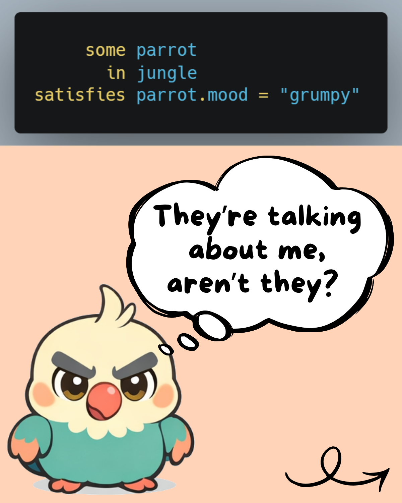
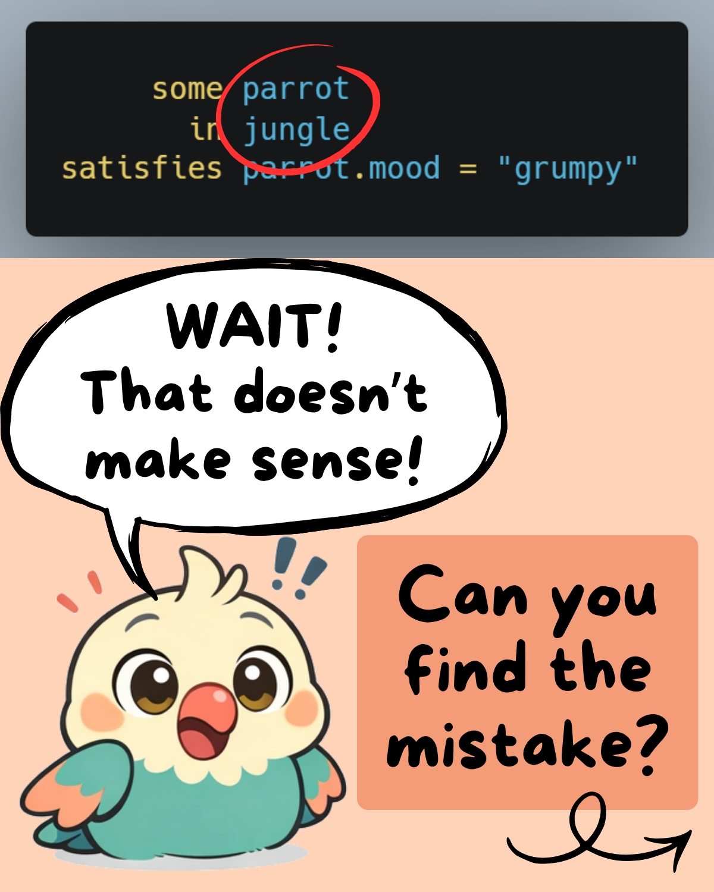
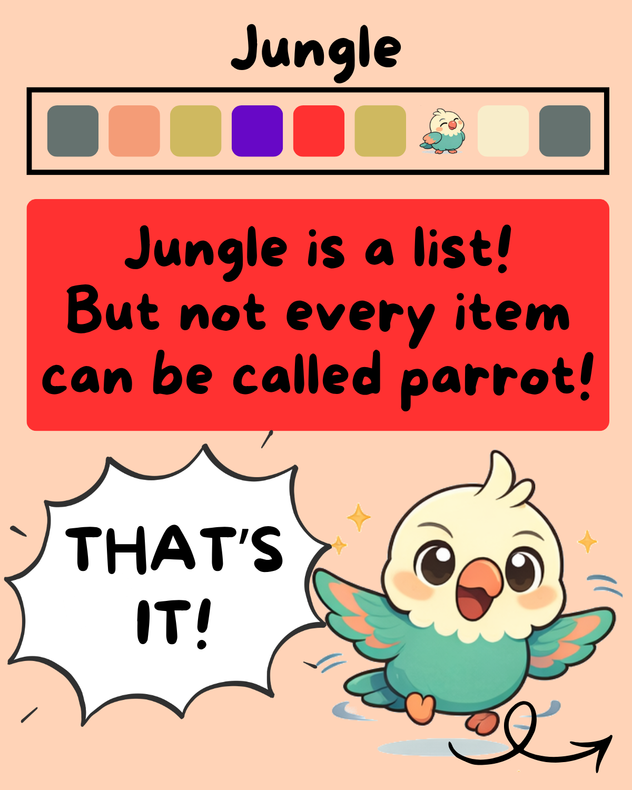
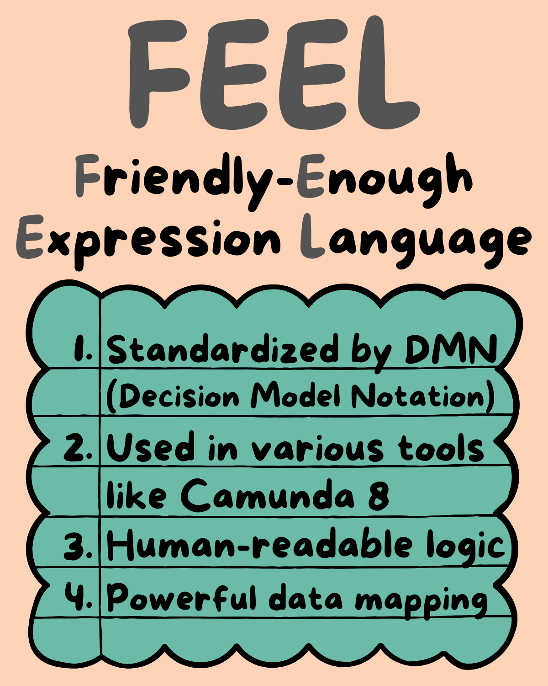

# Introduction – Fun With Lists







## Explanations
Let's take a closer look at this problem!

A FEEL expression is always evaluated as part of an `execution context`, e.g. the available variables in a process instance. In this case, we assume that a `list` of `context objects` called `jungle` is available.

In FEEL the following structure is called `context object`:
```json
{
    "animal": "snake",
    "mood": "cunning"
}
```

Our `execution context` looks like this:
```json
{
    "jungle": [
        {
            "type": "snake",
            "mood": "cunning"
            ...
        },
        {
            "type": "parrot",
            "mood": "grumpy"
            ...
        },
        ...
    ],
    ...
}
```

Each `context object` can have additional fields. The `jungle` will contain more animals, of course. And the `execution context` can contain more variables.

### The Issue
Now, if we go back to the problematic FEEL expression:
```apacheconf   
     some parrot
       in jungle
satisfies parrot.mood = "grumpy"
```
This structure is a combination of iterating over a list and checking if any  expression evaluated for each item in the list results in true.

There is no pressing need to write this expression in three separate line. It does make sense for now, because we will work on each of the three elements on the right-hand side.

As we can see from the `execution context`, not each animal in the `jungle` is a parrot. You could even argue that `jungle` is not a suitable name if it just contains information about animals. There are many ways to make this expression semantically and syntactically correct. At the same time, it has to be correct in terms of the logic it is supposed to capture: There is one or more parrot in the jungle with the mood `grumpy`.

### The Solution
Let's look at some solutions!

By not using `parrot` as the `iterator variable`, but instead using `animal`, we can find the following solution:
```apacheconf                  
     some animal
       in jungle
satisfies animal.type = "parrot" and animal.mood = "grumpy"
```
An additional check for the `type` is necessary. We use logical conjunction by using the keyword `and`.

While we lose the focus on the parrot as the `iterator variable`, the expression that is applied to each item in the list is concise and easy to understand.

We can keep the parrot as the `iterator variable` by ensuring that the list we iterate over only contains parrots.
```apacheconf                  
     some parrot
       in jungle[type = "parrot"]
satisfies parrot.mood = "grumpy"
```
We have now filtered the `jungle` to get a list of `context objects` that fulfil the expression `type = "parrot"`.

While there are other options, the two solutions above are the most suitable. One focusing on all animals, the other on parrots.

### The Alternatives
We can also make use of different FEEL functions and find:
```js                  
any(for animal in jungle return animal.type = "parrot" and animal.mood = "grumpy")
any(for parrot in jungle[type = "parrot"] return parrot.mood = "grumpy")
```
Or:
```apacheconf
count(jungle[type = "parrot" and mood = "grumpy"]) > 0
```
We can take a closer look at these alternatives in a future post.