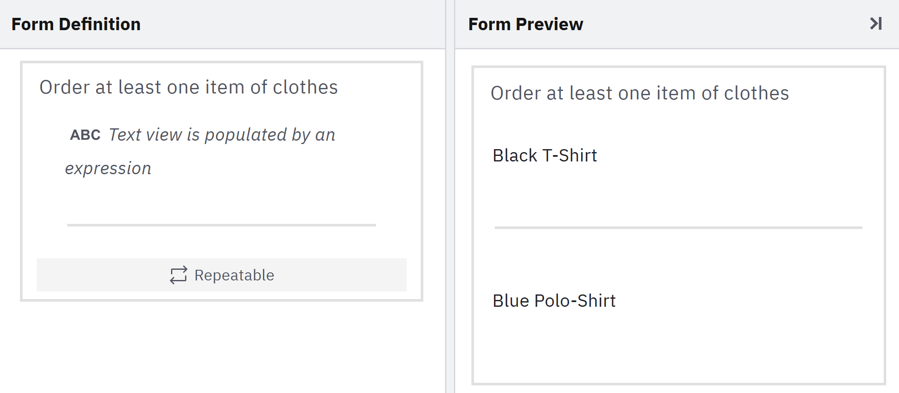
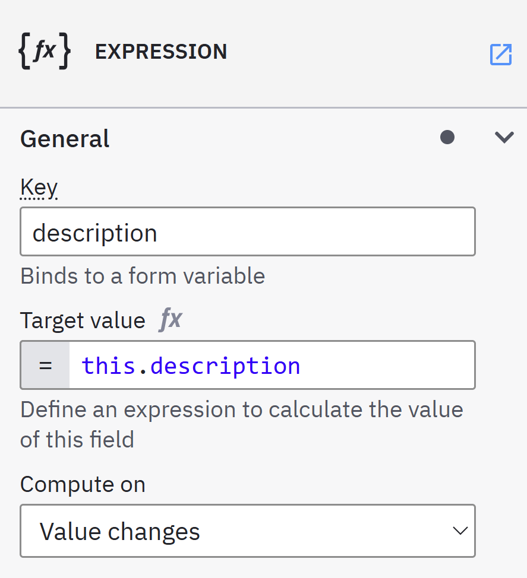
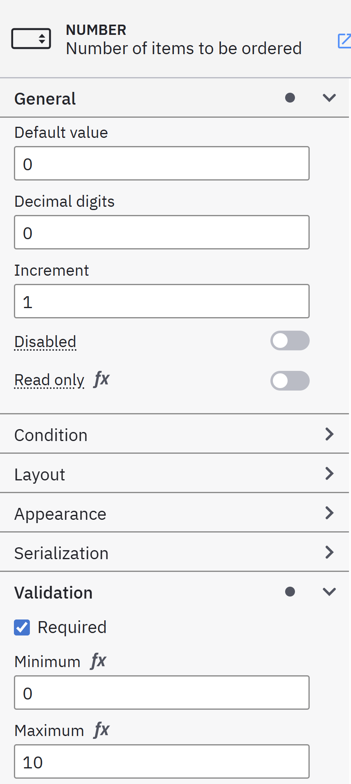
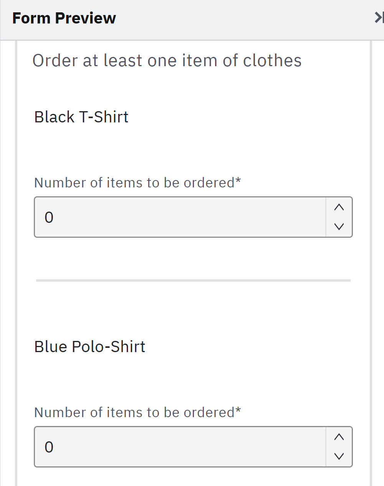
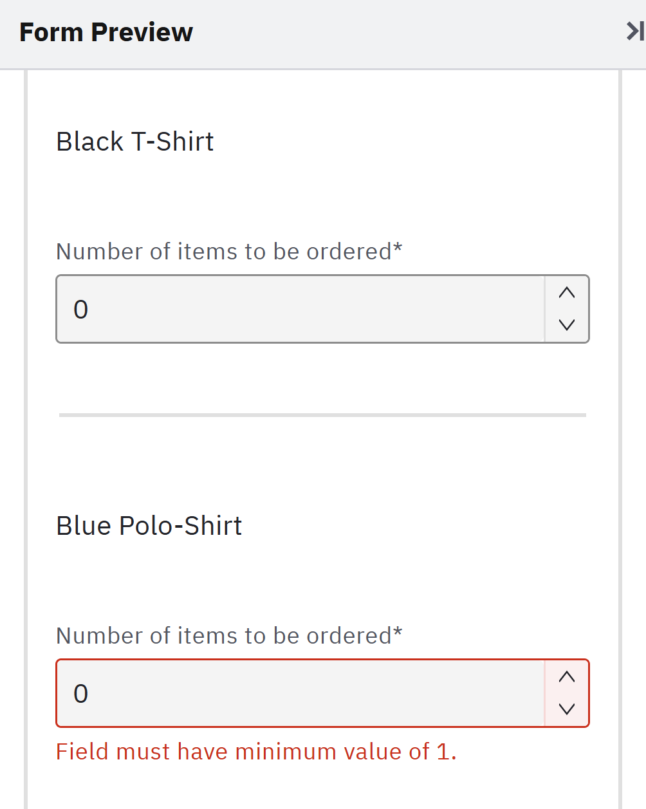

# FEEL in Dynamic Lists

In Camunda 8, FEEL is also used extensively in Forms. In these form snippets, we will delve into a few simple examples. Unfortunately, using many FEEL expression components, dependent hide conditions, etc. can break basic form functionalities. E.g., if a text input is processed by a FEEL expression component, the component might not behave correctly, e.g. entered characters might go missing. When hide conditions depend on each other, the form might behave differently in Camunda Modeler vs. Camunda Tasklist V2 vs. a form-io app.

Thus, I will present some simple use cases, like FEEL expressions for minimum validations, option expressions and simple hide conditions.

## Input Data vs. Runtime Data vs. Submitted Data

When working with forms, dealing with data can become quite tricky. The input data of the form is what you hand over from the BPMN process instance. But after initialization, the input data does not necessarly transform into the runtime data. Data might vanish from the runtime data, because certain components matching input data are hidden. Or more data is added to the runtime data due to entirely new components.

Then again, the runtime data does not necessarly transform into the submitted data. FEEL expression components might compute their value on submit. Data from hidden components might be available in runtime, but not submitted. This behaviour is often not consistent between the Camunda Modeler, Camunda Tasklist V2 and a custom form-io implementation. If your forms behave unexpectedly, you should check these basic functionalities.

## Hiding Dynamic Lists

Dynamic lists often use input data to present a list of context objects. If there is no input data, the resulting empty dynamic list might behave unexpectedly. With hide conditions, you can hide empty dynamic lists. But to do so, you need independent input data to do so. If you try to hide the dynamic list component based on runtime data of the dynamic list component itself, it will not hide itself when empty, because after initialization, it is not empty anymore. That's why I also hand over a listCopy variable that remains static. And I simply base my hide conditions on this static value.

## Today's Issue

We hand over a list of context objects as input data. In this case, it also transforms cleanly into runtime data:
```
{
  "merchClothes": [
		{
			"description": "Black T-Shirt"
		},
		{
			"description": "Blue Polo-Shirt"
		}
	]
}
```

We want to build a form which can only be submitted if at least one item of clothes is ordered.

## The Solution

### Basic Setup

For each context object in the input/runtime data, the form can render a block by using a dynamic list component with the path configured to `merchClothes`.



I like to add a separator component at the end of the dynamic list block. The block is repeated for each item in the represented list. By adding a hide condition, you can easily suppress the separator for its last instance.

`merchClothes[-1].description = this.description`

This is a good example how to use runtime data to manipulate the form.

`merchClothes` is available in the runtime data. We can access its last item via `[-1]`. Then we access some unique information, in this case the description, but it could also be a uuid. We hide the separator when the last items description matches the `block instance`'s description, which can be accessed via `this.description`.

So, for the first block instance, the hide condition compares "Blue Polo-Shirt" (last item) with "Black T-Shirt" (this instance). The separator is not hidden. For the second and last block, "Blue Polo-Shirt" (last item) is compared to "Blue Polo-Shirt" (this instance), and the separator is hidden.

#### Keeping Data Alive

At this moment, you can check the form output. And you will find nothing. We currently only have a `presentation` component which does not generate a form output value. If you want to keep the description, you can simply add a FEEL expression component to map `this.description` to `description`



### Number Component

Now, we add a number component to represent the number of items to be ordered per item of clothes. We can already set minimum and maximum values for this number component.



Now, our form looks great! But, we have not fulfilled the business requirement. With both numbers being zero, we should not be able to submit the form. We need to find a better expression for the minimum validation!



Similar to hiding the separator based on the runtime data, we can also base the minimum validation for each block instance on runtime data, specifically on the current value of the sum of ordered items.

We do not need an overly complex FEEL expression. Let's just do this:

```
if sum(merchClothes.numberToBeOrdered) = 0 
then 1 
else 0
```

By accessing the runtime data of merchClothes and projecting into numberToBeOrdered, we get the sum of all number components. If the sum is 0, we require the minimum of an instance to be 1. If the sum is already larger than 1, we require the minimum to be 0.

One caveat: the minimum expression only evaluates on change. On initialization, the number components won't "complain". A user might try to submit the form with default zeros. So, in my solution, I'll just put 1 as the default value. Now, the form will show a validation error when setting all items to 0. It will then require the latest number component touched to have a minimum of 1!



And, we're done!