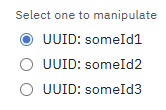
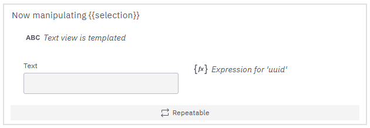
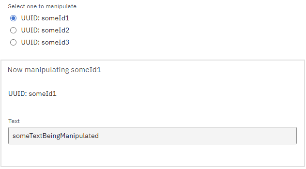
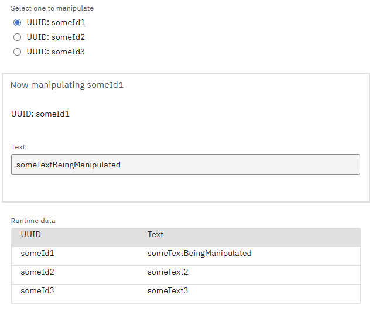

# Manipulate one Item of a Dynamic List


## The Issue

If you ever come across the following very specific requirement, I've got a solution for you:

**From a list of objects, offer a radio group to select one specific object. When it is selected, represent the object with some input form components. The object's data can now be manipulated. The output of the form should be the initial list of objects with the one selected object being replaced with the data from the presented form components.**


## The Solution

Let's start with some input data:
```
{
  "manipulateOne": [
    {
      "uuid": "someId1",
      "text": "someText1"
    },
    {
      "uuid": "someId2",
      "text": "someText2"
    },
    {
      "uuid": "someId3",
      "text": "someText3"
    }
  ]
}
```

### Radio Group

From this input data, we can build a radio group, using FEEL to configure the options dynamically. These options should be static. Therefore, I also add `manipulateOneCopy` to the input data.

```
// option expression
for item
in manipulateOneCopy
return 
  {
    "label": "UUID: " + item.uuid,
    "value": item.uuid
  }
```

The resulting value of our radio group is a uuid, which is nice.



Via input mapping, we can also set a default value, even though the options are dynamic. The `key` of the radio group is called `selection`. So, we can simply add this to the input data:

```
{
  "selection": "someId1"
}
```

Now, the first id is the default value.

### The Filtered Dynamic List

The trick to this issue is to still use a dynamic list to represent the list of objects. The path is `manipulateOne` (not the copy)! I also added a FEEL component to save the `uuid`.



But each component has a hide condition based on the value of `selection`: 

```
// hide condition
selection != this.uuid
``` 

With `this`, we refer to one item. If the uuid of this item is equal to `selection`, the hide condition is `false` and the components are shown. And vice versa. Like this, we only see input components for the item that is selected by the radio group!

If you have a lot of components, you can also add a group and use its hide condition!



The runtime data of this dynamic list only shows data for shown components. Thus, all data of the hidden items is not included. Selecting the second item, the runtime data of the dynamic list is:
```
{ 
  "manipulateOne": [
    null,
    {
      "text": "someTextBeingManipulated",
      "uuid": "someId2"
    }
  ]
}
```

The `null` is interesting, representing the first hidden item. Another `null` for the thrid item does not exist.

### Merging the Data

The crucial part is that we merge this manipulated data with the data of our copied input:
```
for item
in manipulateOneCopy
return
  if selection != null and selection = item.uuid
  then manipulateOne[uuid = selection][1]
  else item
```

We iterate through the copied data and simply replace the one item we currently manipulate in the dynamic list!

In this example, I used this FEEL expression as the input data of a table presentation form component. Here you can see the final result:



In practice, you should merge the data in the output mapping, unless you need it in the form itself. It is always better to extract FEEL computation out of the form if possible. When the form library is busy computing some complex FEEL expression, user input can lag!

### The Input Data

```
{
  "selection": "someId1",
  "manipulateOne": [
    {
      "uuid": "someId1",
      "text": "someText1"
    },
    {
      "uuid": "someId2",
      "text": "someText2"
    },
    {
      "uuid": "someId3",
      "text": "someText3"
    }
  ],
  "manipulateOneCopy": [
    {
      "uuid": "someId1",
      "text": "someText1"
    },
    {
      "uuid": "someId2",
      "text": "someText2"
    },
    {
      "uuid": "someId3",
      "text": "someText3"
    }
  ]
}
```
