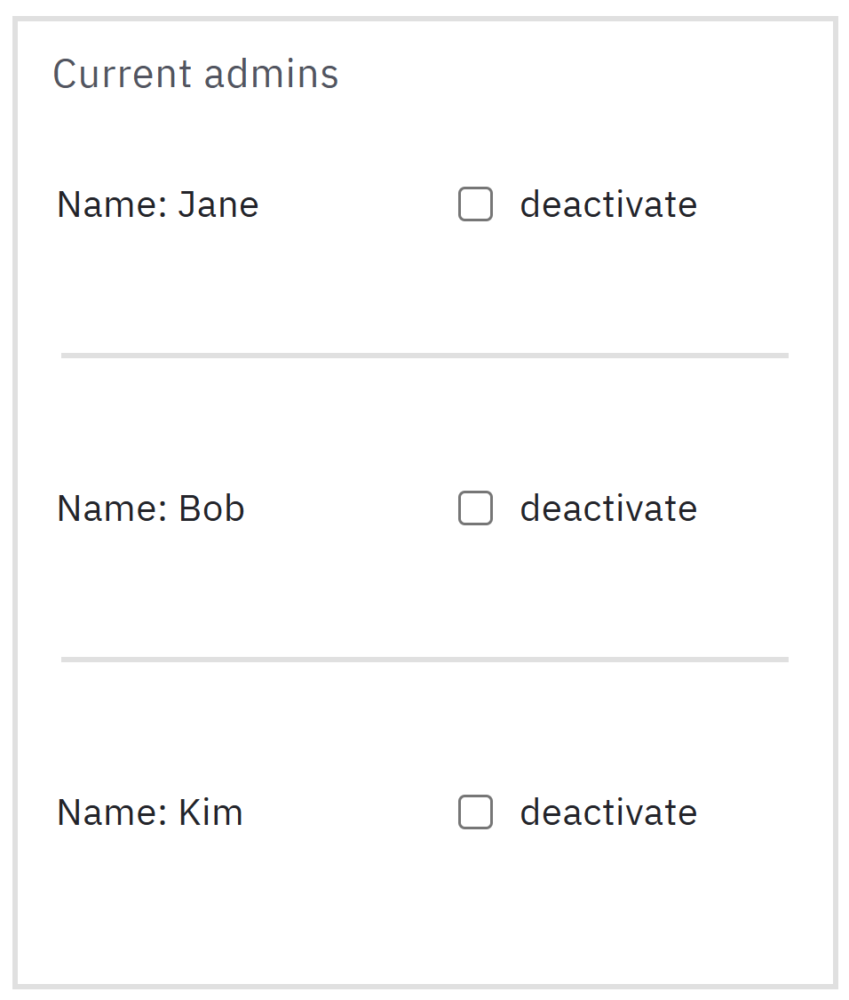
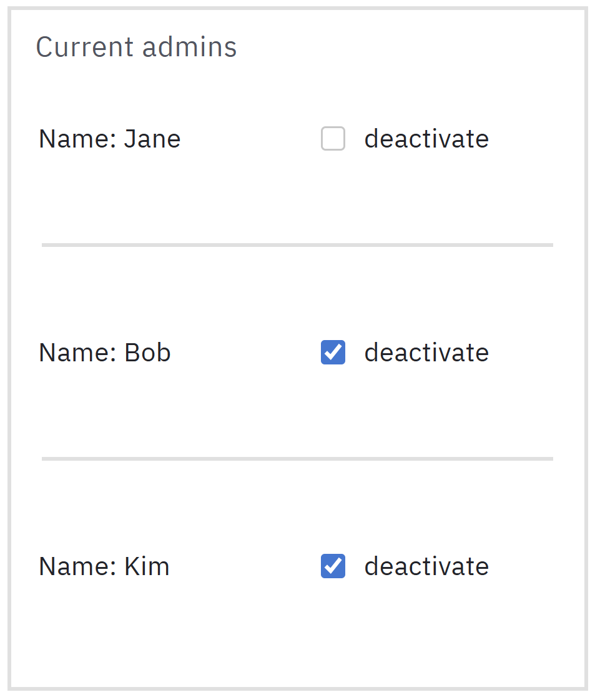

# Camunda Forms: Deactivate n-1 Checkboxes

## The Issue

Again, we work with a list of items. In this case, we have a list of current admins of an IT-system.

The form will present each admin as an item of a `dynamic list`. The super user can now deactivate `n - 1` admins via checkboxes. At least one admin has to stay active. 

## The Solution

When `n - 1` checkboxes are checked, the last one needs to become read-only, so it stays unchecked. But all other checked boxed need remain editable. If suddenly all checkboxes are read-only, the user will be stuck.

### Form Setup

Our input data:
```
{
  "adminList": [
    {
      "name": "Jane"
    },
    {
      "name": "Bob"
    },
    {
      "name": "Kim"
    }
  ]
}
```

Setting up a suitable dynamic list, we can the following form:


### The Logic

We need to be careful with the read-only FEEL expression for the checkboxes. Because we are using a dynamic list, each checkbox has the same expression!

It is clear that our expression needs two parts. One part takes care of staying editable when checked. The other takes care of being read-only if `n - 1` checkboxes are already checked.

Let's say we want to use `and` to connect the two parts:

**The checkbox must be disabled** and **The other `n - 1` boxes have been checked**

```
// this must be disabled
not(this.deactivate) 
and 
// number of deactivated admins = n - 1
count(adminList[deactivate = true]) = count(adminList) - 1
```

Here is the final result:



Checked boxes remain editable. The last unchecked box is now disabled.

Your form can ensure the proper behaviour of your system before it is even submitted!